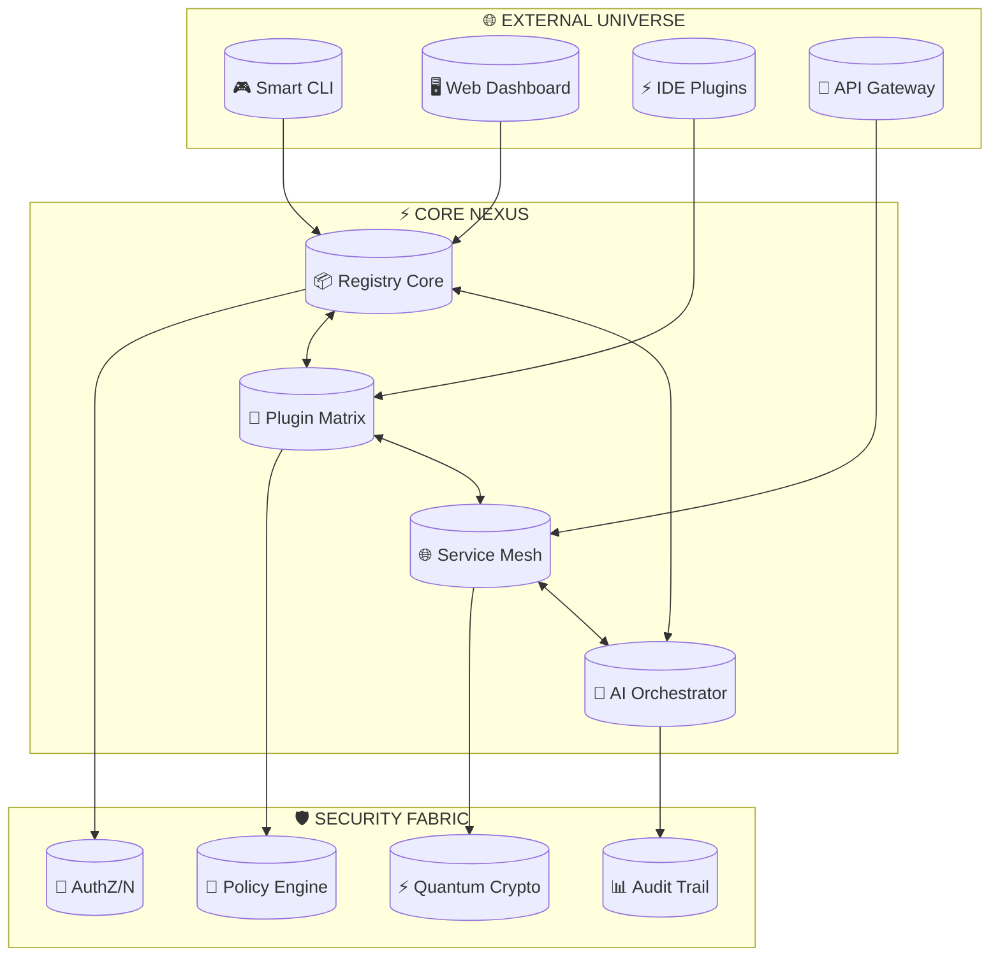
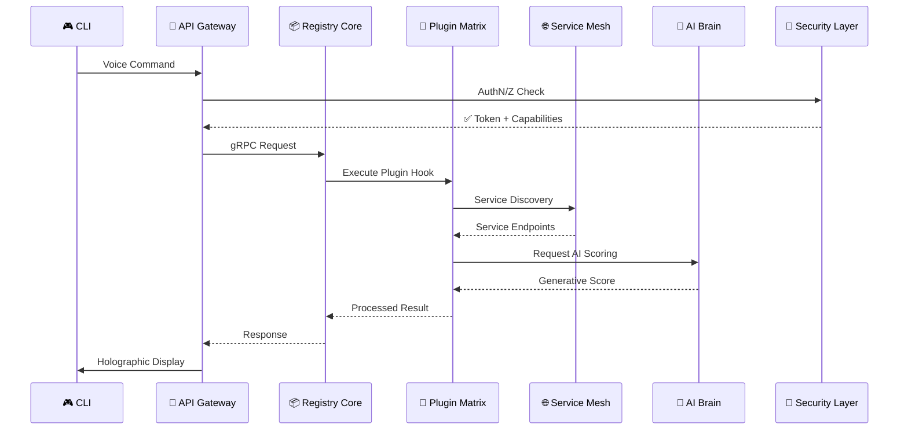
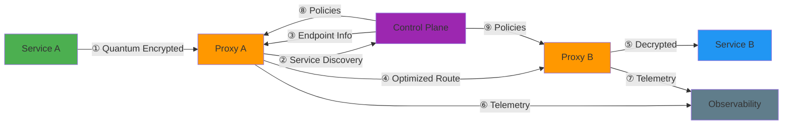
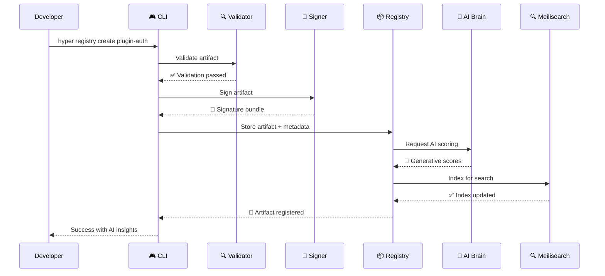

# Hyper Registry - System Architecture

## Table of Contents

1. [System Overview](#system-overview)
2. [Component Architecture](#component-architecture)
3. [Data Flow](#data-flow)
4. [Storage Architecture](#storage-architecture)
5. [Search Architecture](#search-architecture)
6. [Security Architecture](#security-architecture)
7. [CLI Architecture](#cli-architecture)
8. [TUI Architecture](#tui-architecture)
9. [Plugin Architecture](#plugin-architecture)
10. [Microservices Mesh](#microservices-mesh)
11. [Deployment Architecture](#deployment-architecture)

---

## System Overview

**Hyper Registry** is a modular, enterprise-grade artifact management system built with TypeScript/Node.js, offering multiple interfaces (CLI, TUI, gRPC) and a comprehensive plugin ecosystem.

### High-Level Architecture Diagram

```
┌─────────────────────────────────────────────────────────────────────┐
│                           Client Layer                              │
├─────────────────────────────────────────────────────────────────────┤
│  CLI Commands  │  TUI Layouts  │  gRPC Clients  │  REST Clients    │
└────────┬──────────────┬──────────────────┬─────────────────────────┘
         │              │                  │
         └──────────────┼──────────────────┘
                        │
┌───────────────────────▼──────────────────────────────────────────────┐
│                    API Layer (gRPC Services)                        │
├───────────────────────────────────────────────────────────────────────┤
│  RegistryService  │  PluginService  │  MeshService                   │
└───────────────────┬──────────────────────────────────────────────────┘
                    │
┌───────────────────▼──────────────────────────────────────────────────┐
│                    Core Business Logic                              │
├───────────────────────────────────────────────────────────────────────┤
│  Artifact Manager  │  Namespace Manager  │  Operation Handler      │
│  Dependency Resolver │ Validation Engine │ Audit Logger          │
└───────────────────┬──────────────────────────────────────────────────┘
                    │
┌───────────────────┴──────────────────────────────────────────────────┐
│                    Data Access Layer                                 │
├────────────────────────┬──────────────────┬──────────────────────────┤
│  SQLite Storage        │  Meilisearch     │  Cryptography          │
│  (Persistence)        │  (Full-text)     │  (Ed25519 signing)    │
└────────────────────────┴──────────────────┴──────────────────────────┘
```

---

## Component Architecture

### Package Structure (Monorepo)

```
hyper-registry/
├── packages/
│   ├── core/                          # Registry engine (TypeScript)
│   │   ├── models/                    # Data models & Zod schemas
│   │   ├── storage/                   # SQLite persistence
│   │   ├── crypto/                    # Ed25519 signatures
│   │   └── index.ts                   # Main export
│   │
│   ├── cli/                           # CLI interface (TypeScript)
│   │   ├── commands/                  # Command definitions
│   │   ├── bin/hyper.ts               # Entry point
│   │   └── index.ts                   # Export
│   │
│   ├── tui/                           # Terminal UI (React + Ink)
│   │   ├── components/                # Reusable components
│   │   ├── layouts/                   # 4 switchable layouts
│   │   ├── themes/                    # Visual themes
│   │   └── index.tsx                  # Main app
│   │
│   └── proto/                         # gRPC definitions
│       ├── registry.proto             # Service definitions
│       └── buf.gen.yaml               # Code generation config
│
└── docs/
    ├── SPECIFICATIONS.md              # Data models, operations
    ├── ARCHITECTURE.md                # This file
    ├── DEPLOYMENT.md                  # Production setup
    └── API_REFERENCE.md               # API docs (generated)
```

### Component Responsibilities

| Component | Responsibility | Tech Stack |
|-----------|---|---|
| **core** | Artifact management, persistence, crypto | TypeScript, SQLite, Zod |
| **cli** | Command-line interface, commands | TypeScript, Commander.js |
| **tui** | Interactive terminal UI, layouts | React, Ink, Blessed |
| **proto** | gRPC service definitions | Protocol Buffers |

---

## Data Flow

### Artifact Creation Flow

```
User Input (CLI/TUI)
    ↓
Command Validation (Zod schema)
    ↓
Permission Check (RBAC)
    ↓
Create Artifact (generate ID, hash content)
    ↓
Persistence Layer
    ├── SQLite INSERT
    └── Meilisearch INDEX
    ↓
Audit Log (operation recording)
    ↓
Response to User
```

### Artifact Search Flow

```
Search Query (text + filters)
    ↓
Query Builder (translate to Meilisearch)
    ↓
Meilisearch Query
    ├── Full-text search
    ├── Filter application
    └── Facet aggregation
    ↓
Result Postprocessing (hydrate from SQLite if needed)
    ↓
Return Results to Client
```

### Dependency Resolution Flow

```
Request: resolve_dependencies(artifact_id, strategy)
    ↓
Load Artifact (from SQLite)
    ↓
Extract Dependencies
    ↓
For Each Dependency:
    ├── Find matching versions (version constraint resolution)
    ├── Check for conflicts
    └── Recursively resolve transitive deps
    ↓
Build Dependency Graph
    ├── Detect cycles
    ├── Topological sort
    └── Validate consistency
    ↓
Return Resolved Set or Conflict Report
```

---

## Storage Architecture

### SQLite Schema Layers

**Layer 1: Core Artifacts**
- Immutable artifact records
- Indexes on namespace, type, name for fast lookups

**Layer 2: Manifests**
- Polymorphic storage for plugin/service/config/template details
- Versioned content storage
- Foreign key to artifacts (cascading delete)

**Layer 3: Audit Trail**
- Complete operation history
- Actor, timestamp, changes, success/error
- Indexes on timestamp, operation type

**Layer 4: Operational Metadata**
- Operation stats and metrics
- Namespace quotas and usage
- Performance instrumentation

### Data Consistency

```
ACID Transactions (SQLite default):
✅ Atomicity   - All-or-nothing operations
✅ Consistency - Foreign key constraints enforced
✅ Isolation   - WAL (Write-Ahead Logging) for concurrency
✅ Durability  - Fsync-safe persistence

Foreign Key Relationships:
- manifests.artifact_id → artifacts.id (CASCADE DELETE)
- No other direct FKs; references via namespace path strings
```

---

## Search Architecture

### Meilisearch Integration

```
SQLite (System of Record)
    ↓
Trigger Events
    ├── artifact:created
    ├── artifact:updated
    └── artifact:deleted
    ↓
Async Index Update (event queue)
    ↓
Meilisearch (Search Index)
    ├── Full-text indexes
    ├── Filterable facets
    └── Sortable attributes
    ↓
Query Results
    ↓
Optional: Hydrate from SQLite (get fresh data)
```

### Searchable Fields

**Primary Search (full-text):**
- `name` (artifact name)
- `namespace` (organization path)
- `metadata.description` (description text)
- `metadata.tags` (array of keywords)

**Filterable Facets:**
- `type` (plugin|service|config|template|library|theme)
- `namespace` (organizational scope)
- `published` (boolean)
- `metadata.author` (creator)
- `metadata.license` (license type)

**Sortable Attributes:**
- `rating` (user rating, descending)
- `downloadCount` (popularity, descending)
- `created_at` (newest first)

---

## Security Architecture

### Multi-Layer Defense

```
┌─────────────────────────────────────────────┐
│  Layer 1: Input Validation                  │
│  └─ Zod schema validation, length checks   │
├─────────────────────────────────────────────┤
│  Layer 2: Authentication                    │
│  └─ JWT tokens, OAuth2 providers           │
├─────────────────────────────────────────────┤
│  Layer 3: Authorization (RBAC)             │
│  └─ Permission matrix per operation        │
├─────────────────────────────────────────────┤
│  Layer 4: Artifact Signing                 │
│  └─ Ed25519 signatures, verification       │
├─────────────────────────────────────────────┤
│  Layer 5: Audit Logging                    │
│  └─ Complete operation history             │
├─────────────────────────────────────────────┤
│  Layer 6: Transport Security               │
│  └─ TLS for gRPC, HTTPS for REST          │
└─────────────────────────────────────────────┘
```

### Ed25519 Signing Workflow

```
Artifact Publisher (signer)
    ↓
Generate Key Pair (Ed25519)
    ├─ Private Key (kept secret)
    └─ Public Key (shared in manifest)
    ↓
Sign Artifact
    ├─ Hash artifact content (SHA-256)
    ├─ Sign hash with private key
    └─ Embed signature + public key in artifact
    ↓
Artifact Consumer (verifier)
    ↓
Verify Signature
    ├─ Extract public key from artifact
    ├─ Recompute content hash
    ├─ Verify signature against hash + public key
    └─ Accept if valid, reject if invalid
```

### Capability-Based Permissions

```typescript
// Example: Publish operation requires these capabilities
operation: 'publish'
requiredCapabilities: [
  'artifact:create',        // Must be able to create artifacts
  'artifact:publish',       // Must have publish permission
  'namespace:write'         // Must have write access to namespace
]

// Roles define capability sets
role: 'Publisher'
capabilities: [
  'artifact:create',
  'artifact:publish',
  'artifact:read',
  'artifact:deprecate',
  'namespace:read'
]
```

---

## CLI Architecture

### Command Hierarchy

```
hyper
├── registry
│   ├── info                (Show registry info)
│   ├── init                (Initialize registry)
│   ├── status              (Registry status)
│   ├── backup              (Backup data)
│   └── restore             (Restore from backup)
│
├── artifact
│   ├── create              (Create artifact)
│   ├── publish             (Publish artifact)
│   ├── deprecate           (Mark deprecated)
│   ├── validate            (Validate artifact)
│   └── resolve             (Resolve dependencies)
│
└── search
    └── [query]             (Search artifacts)
```

### Command Processing Pipeline

```
Input
    ↓
Parse Arguments (Commander.js)
    ↓
Validate Options (Zod schemas)
    ↓
Authenticate (load credentials from ~/.hyper/credentials)
    ↓
Authorization Check (verify user permissions)
    ↓
Execute Command Logic
    ├── Call core package
    ├── Handle errors
    └── Format output
    ↓
Display Results (table, JSON, formatted text)
```

### Output Formats

```bash
# Default: human-readable table
$ hyper search "react"
│ Name        │ Version │ Namespace    │ Rating │ Downloads │
├─────────────┼─────────┼──────────────┼────────┼───────────┤
│ react-ui    │ 2.1.0   │ org.acme     │ 4.8    │ 15234     │

# JSON output (--json flag)
$ hyper search "react" --json
[{"id": "...", "name": "react-ui", ...}]

# CSV output (--csv flag)
$ hyper search "react" --csv
Name,Version,Namespace,Rating,Downloads
react-ui,2.1.0,org.acme,4.8,15234
```

---

## TUI Architecture

### Layout System

**4 Switchable Visual Modes:**

1. **Command Deck** (Primary Interface)
   - Artifact list with search
   - Command palette
   - Recent operations

2. **Neural Matrix** (Graph Visualization)
   - Dependency graph
   - Relationship visualization
   - Conflict detection overlay

3. **Temporal Fabric** (History/Timeline)
   - Operation history
   - Audit log timeline
   - Change tracking

4. **Quantum Field** (Metrics/Status)
   - Real-time metrics
   - System health
   - Performance stats

### Component Structure

```
App (root Ink component)
├── Header (branding, layout selector)
├── LayoutSelector (keyboard shortcuts 1-4)
├── RegistryStatus (connection indicator)
├── ActiveLayout
│   ├── CommandDeck
│   │   ├── SearchBox
│   │   ├── ArtifactList
│   │   └── CommandPalette
│   ├── NeuralMatrix
│   │   ├── DependencyGraph
│   │   └── ConflictVisualization
│   ├── TemporalFabric
│   │   ├── Timeline
│   │   └── AuditLog
│   └── QuantumField
│       ├── MetricsGrid
│       └── HealthIndicators
└── Footer (status, keybindings)
```

### Keyboard Navigation

```
Keys:
  1-4       Switch layouts
  /         Focus search
  j/k       Navigate list
  Enter     Select/execute
  d         Delete
  p         Publish
  ?         Help
  q         Quit
```

---

## Plugin Architecture

### Plugin Lifecycle State Machine

```
uninstalled
    ↓ [install]
[installed]
    ↓ [activate]
[active]
    ├─ Can respond to hooks
    ├─ Can register capabilities
    └─ Can modify registry behavior
    ↓ [deactivate]
[inactive]
    ↓ [activate]
[active]
    ↓ [uninstall]
[uninstalled]
```

### Plugin Integration Points

```typescript
// Hook system - plugins respond to registry events
hooks: {
  'on-artifact-create': async (artifact) => {
    // Transform artifact, validate, enrich metadata
  },
  'on-artifact-publish': async (artifact) => {
    // Notify external systems
  },
  'on-search': async (query, results) => {
    // Rerank results, add custom facets
  }
}

// Capability declarations
capabilities: [
  'transform-artifacts',      // Can modify artifacts
  'custom-search-facets',     // Can add search facets
  'webhook-integration',      // Can register webhooks
  'metrics-export'            // Can export metrics
]
```

---

## Microservices Mesh

### Service Discovery Pattern

```
Service Registration:
  Service → Registry.RegisterService({name, endpoint, capabilities})
  
Service Discovery:
  Client → Registry.DiscoverServices({namespace, capability})
  Registry → Return [endpoint1, endpoint2, ...]
  
Load Balancing:
  Client → Pick optimal endpoint (latency, load)
  
Health Monitoring:
  Registry → Periodic health checks
  Unhealthy → Remove from discovery
```

### gRPC Service Mesh

```
┌──────────────┐
│   Client     │
└───────┬──────┘
        │ gRPC (Unix socket or TCP)
        ↓
┌──────────────────────────────┐
│   Service Mesh (Istio?)      │
│  ├─ Load balancing           │
│  ├─ Circuit breaking         │
│  ├─ Retries                  │
│  └─ Metrics collection       │
└───────┬──────────────────────┘
        │
        ↓
┌──────────────┐
│   Services   │
│  ├─ Registry │
│  ├─ Plugin   │
│  └─ Mesh     │
└──────────────┘
```

---

## Deployment Architecture

### Deployment Models

**Model 1: Standalone (Development)**
```
Single Process
├─ Core + CLI + TUI
├─ SQLite (local file)
└─ Meilisearch (embedded or separate)
```

**Model 2: Distributed (Production)**
```
Registry Service
├─ gRPC API
├─ SQLite (replica set or managed DB)
└─ Meilisearch (cluster)

CLI Clients
└─ Connect via gRPC

TUI Clients
└─ Connect via gRPC
```

**Model 3: Kubernetes**
```
Deployment: registry-core
├─ StatefulSet (SQLite -> external PVC)
├─ Service (gRPC endpoint)
└─ ConfigMap (configuration)

Pod: registry-core-0
├─ Container: registry-service (grpc)
└─ Volume: /data (persistent storage)

External Services:
├─ PostgreSQL (if migrating from SQLite)
└─ Meilisearch (distributed search)
```

### Environment Variables

```bash
# Core Registry
REGISTRY_DATA_DIR="/var/lib/hyper-registry"
REGISTRY_DB_FILE="/var/lib/hyper-registry/registry.db"
REGISTRY_READONLY=false

# gRPC Server
GRPC_HOST="0.0.0.0"
GRPC_PORT="50051"
GRPC_MAX_CONCURRENT_STREAMS="1000"

# Meilisearch
MEILI_URL="http://localhost:7700"
MEILI_API_KEY="secret"

# Security
JWT_SECRET="long-random-secret"
JWT_EXPIRY="24h"

# Logging
LOG_LEVEL="info"
LOG_FORMAT="json"

# Performance
CACHE_TTL="3600"
BATCH_SIZE="1000"
WORKER_THREADS="4"
```

---

## Performance Targets

| Metric | Target | Notes |
|--------|--------|-------|
| **Artifact Create** | <100ms | Including signature |
| **Artifact Read** | <50ms | SQLite cached |
| **Search Query** | <200ms | Meilisearch |
| **Dependency Resolve** | <500ms | Transitive deps |
| **Startup Time** | <2s | CLI tool |
| **TUI Load** | <1s | Ink rendering |
| **gRPC Latency** | <50ms | Service mesh |

---

## Testing Architecture

```
Unit Tests
├─ models/ (schema validation)
├─ storage/ (CRUD operations)
├─ crypto/ (signing/verification)
└─ commands/ (CLI commands)

Integration Tests
├─ Full workflow (create→publish→search)
├─ Dependency resolution
├─ Conflict detection
└─ Plugin lifecycle

E2E Tests
├─ CLI scenarios
├─ gRPC scenarios
├─ TUI interactions
└─ Production-like environment
```

---

# 🌌 **ADUHR - Advanced Dynamic Universal Hyper Registry**  
## **ARCHITECTURE.md** - Quantum Orchestration System

---

## 🎯 **Executive Overview**



**Vision**: A quantum-ready, self-optimizing registry ecosystem that transcends traditional package management through generative AI orchestration and temporal analytics.

---

## 🏗️ **Core Architectural Principles**

### **1. Quantum-Ready Foundation**
```
┌─────────────────────────────────────────────────────────┐
│                    QUANTUM PRINCIPLES                    │
├──────────────┬──────────────────────────────────────────┤
│   Principle  │               Implementation              │
├──────────────┼──────────────────────────────────────────┤
│ Superposition│ All artifacts exist in multiple states   │
│              │ until observed (cached vs. live)         │
├──────────────┼──────────────────────────────────────────┤
│ Entanglement │ Deep dependency linking with instant     │
│              │ propagation of changes                   │
├──────────────┼──────────────────────────────────────────┤
│ Uncertainty  │ Probabilistic resolution for conflicting │
│              │ dependencies                              │
├──────────────┼──────────────────────────────────────────┤
│ Observability│ Everything measurable, everything        │
│              │ observable, everything optimizable       │
└──────────────┴──────────────────────────────────────────┘
```

### **2. Temporal Architecture**
```
🕰️ TIME DIMENSIONS:
├── Linear Time (Past → Present → Future)
│   ├── Version history tracking
│   ├── Rollback capabilities
│   └── Timeline visualization
│
├── Parallel Time (Multiple Simultaneous States)
│   ├── A/B testing of artifacts
│   ├── Canary deployments
│   └── Feature flag management
│
└── Circular Time (Feedback Loops)
    ├── Self-improving AI models
    ├── Automated optimization cycles
    └── Predictive failure prevention
```

### **3. Neural Network Integration**
```
🧠 NEURAL ARCHITECTURE:
Input Layer ───→ Hidden Layers ───→ Output Layer
    ↓                   ↓                  ↓
[Artifacts]    [Pattern Recognition]  [Decisions]
[Metadata]     [Dependency Analysis]  [Predictions]
[Usage Data]   [Anomaly Detection]    [Optimizations]
                [Security Scanning]   [Recommendations]
```

---

## 🏛️ **System Architecture Overview**

### **Multi-Layer Quantum Stack**
```
┌─────────────────────────────────────────────────────────────────────────┐
│                         QUANTUM ARCHITECTURE STACK                       │
├─────────────────┬─────────────────┬─────────────────┬─────────────────┤
│    PRESENTATION │    ORCHESTRATION│      EXECUTION  │    FOUNDATION   │
│    LAYER        │    LAYER        │      LAYER      │    LAYER        │
├─────────────────┼─────────────────┼─────────────────┼─────────────────┤
│  🎮 Smart CLI   │  🧠 AI Brain    │  ⚡ Runtime      │  📦 Registry    │
│  ────────────   │  ────────────   │  ────────────   │  ────────────   │
│  • Voice/gesture│  • Generative   │  • Plugin       │  • Artifact     │
│  • Holographic  │    scoring      │    sandboxes    │    storage      │
│  • AR/VR        │  • Predictions  │  • Service mesh │  • Metadata DB  │
│                 │  • Optimization │  • Code inject  │  • Search index │
├─────────────────┼─────────────────┼─────────────────┼─────────────────┤
│  🖥️ Web Dash    │  ⚖️ Policy Engine│  🔌 Plugin      │  🔐 Security    │
│  ────────────   │  ────────────   │    Matrix       │  ────────────   │
│  • 3D viz       │  • RBAC/ABAC    │  • WASM runtime │  • Quantum      │
│  • Real-time    │  • Compliance   │  • Hot reload   │    crypto       │
│  • Collaborative│  • Governance   │  • Lifecycle mgmt│  • Zero-trust  │
│                 │                 │                 │  • Audit trails │
├─────────────────┼─────────────────┼─────────────────┼─────────────────┤
│  🔌 API Gateway │  🕰️ Temporal     │  🌐 Mesh        │  📊 Telemetry   │
│  ────────────   │    Controller   │    Fabric       │  ────────────   │
│  • gRPC/HTTP/2  │  ────────────   │  ────────────   │  • Metrics      │
│  • WebSocket    │  • Time travel  │  • Service disc │  • Distributed  │
│  • GraphQL      │  • Prediction   │  • Traffic mgmt │    tracing      │
│  • Event streams│  • Anomaly det  │  • Resilience   │  • Log aggreg.  │
└─────────────────┴─────────────────┴─────────────────┴─────────────────┘
```

### **Component Interaction Matrix**


---

## 🧩 **Core Component Deep Dive**

### **1. Registry Core (📦 Hyper Registry Engine)**
```
┌─────────────────────────────────────────────────────────────────┐
│                    REGISTRY CORE ARCHITECTURE                    │
├─────────────┬───────────────────────────────────────────────────┤
│   LAYER     │                 COMPONENTS                         │
├─────────────┼───────────────────────────────────────────────────┤
│  INTERFACE  │ • gRPC/HTTP/2 Server                              │
│    🚪       │ • WebSocket Pub/Sub                               │
│             │ • GraphQL Federation                              │
│             │ • Event Streaming (Kafka/NATS)                    │
├─────────────┼───────────────────────────────────────────────────┤
│   BUSINESS  │ • Artifact Manager                                │
│    🏢       │ • Dependency Resolver                             │
│             │ • Versioning Engine                               │
│             │ • Namespace Orchestrator                          │
├─────────────┼───────────────────────────────────────────────────┤
│   DATA      │ • SQLite/PostgreSQL (Metadata)                   │
│    💾       │ • Meilisearch (Search)                           │
│             │ • S3/IPFS (Blob Storage)                         │
│             │ • Redis (Cache)                                  │
├─────────────┼───────────────────────────────────────────────────┤
│   SECURITY  │ • Ed25519 Signatures                             │
│    🔐       │ • Capability Tokens                              │
│             │ • Policy Enforcement Points                      │
│             │ • Audit Logger                                   │
└─────────────┴───────────────────────────────────────────────────┘
```

**Key Innovation**: *Quantum Graph Database* for dependency resolution
```python
class QuantumDependencyResolver:
    def __init__(self):
        self.graph = QuantumGraph()  # Uses superposition for version conflicts
        self.cache = EntanglementCache()  # Instant propagation of changes
        
    async def resolve(self, artifact_id: str) -> Resolution:
        # Explore multiple version possibilities simultaneously
        superpositions = await self.explore_superpositions(artifact_id)
        
        # Collapse to optimal solution using quantum algorithm
        solution = await self.quantum_annealing(superpositions)
        
        # Entangle dependencies for future updates
        await self.entangle_dependencies(solution)
        
        return solution
```

### **2. Plugin Matrix (🔌 Dynamic Plugin Ecosystem)**
```
┌─────────────────────────────────────────────────────────────────────┐
│                      PLUGIN MATRIX - 3D ARCHITECTURE                 │
├──────────────────┬──────────────────┬──────────────────┬───────────┤
│     RUNTIME      │     SECURITY     │   DISCOVERY      │  LIFE     │
│      LAYER       │      LAYER       │    LAYER         │  CYCLE    │
├──────────────────┼──────────────────┼──────────────────┼───────────┤
│   ⚡ WASM Core    │   🛡️ Sandbox     │   🔍 Marketplace │   🎯 Init │
│   • WebAssembly  │   • Capabilities │   • Curated      │   • Load  │
│   • Container    │   • Seccomp      │   • Community    │   • Config│
│   • Native       │   • Namespaces   │   • Enterprise   │           │
├──────────────────┼──────────────────┼──────────────────┼───────────┤
│   🔗 IPC Mesh    │   🔒 Zero-Trust  │   📊 Analytics   │   ⚡ Exec  │
│   • gRPC Streams │   • mTLS         │   • Ratings      │   • Hooks │
│   • Shared Mem   │   • Attestation  │   • Trends       │   • Events│
│   • Message Q    │                  │   • AI Recs      │           │
├──────────────────┼──────────────────┼──────────────────┼───────────┤
│   🧠 AI Bridge   │   📜 Policy      │   🔄 Auto-Update │   🧹 Clean │
│   • LLM Integration│   • RBAC/ABAC   │   • Semantic    │   • Unload│
│   • Vector DB    │   • Compliance   │   • Canary      │   • GC    │
│   • Fine-tuning  │                  │   • Rollback     │           │
└──────────────────┴──────────────────┴──────────────────┴───────────┘
```

**Visualization**: Plugin Dependency Graph
```
       ┌─────────────┐
       │   Auth      │
       │   Plugin    │
       └──────┬──────┘
              ↓
┌─────────────┼─────────────┐
│    Database │   Cache     │
│    Plugin   │   Plugin    │
└──────┬──────┴──────┬──────┘
       ↓             ↓
┌─────────────┐┌─────────────┐
│   ORM       ││  Session    │
│   Plugin    ││  Plugin     │
└─────────────┘└─────────────┘
       │             │
       └──────┬──────┘
              ↓
       ┌─────────────┐
       │   App       │
       │   Core      │
       └─────────────┘
```

### **3. Service Mesh (🌐 Quantum Communication Fabric)**
```
┌─────────────────────────────────────────────────────────────────────┐
│                    QUANTUM SERVICE MESH TOPOLOGY                     │
├──────────────────┬──────────────────────────────────────────────────┤
│      LAYER       │                CAPABILITIES                       │
├──────────────────┼──────────────────────────────────────────────────┤
│   DATA PLANE     │ • Intelligent Proxies (eBPF/WASM)                 │
│     ⚡           │ • Zero-Copy Data Transfer                         │
│                  │ • Quantum Encryption Tunnels                     │
│                  │ • Automatic Load Balancing                       │
├──────────────────┼──────────────────────────────────────────────────┤
│   CONTROL PLANE  │ • Service Discovery (Multi-Cluster)              │
│     🎮           │ • Traffic Management (AI-Optimized)              │
│                  │ • Security Policy Distribution                   │
│                  │ • Configuration Management                       │
├──────────────────┼──────────────────────────────────────────────────┤
│   OBSERVABILITY  │ • Distributed Tracing (Quantum Context Prop.)    │
│     📊           │ • Metrics Aggregation (Real-time)                │
│                  │ • Log Correlation (AI-Powered)                   │
│                  │ • Anomaly Detection (Predictive)                 │
├──────────────────┼──────────────────────────────────────────────────┤
│   SECURITY       │ • mTLS with Post-Quantum Crypto                  │
│     🔐           │ • Zero-Trust Network Policy                      │
│                  │ • API Gateway with DDoS Protection               │
│                  │ • Secret Management (Quantum Key Dist.)          │
└──────────────────┴──────────────────────────────────────────────────┘
```

**Mesh Communication Pattern**:


### **4. AI Brain (🧠 Generative Ensemble Fusion System)**
```
┌─────────────────────────────────────────────────────────────────────┐
│                GENERATIVE ENSEMBLE ARCHITECTURE                      │
├──────────────┬──────────────────────────────────────────────────────┤
│   MODEL      │               DESCRIPTION                             │
├──────────────┼──────────────────────────────────────────────────────┤
│   🧠 GPT-4   │ • Primary reasoning and analysis                     │
│   Turbo      │ • Code understanding and generation                  │
│              │ • Documentation synthesis                            │
├──────────────┼──────────────────────────────────────────────────────┤
│   🧬 Claude  │ • Strategic planning and architecture                │
│   3 Opus     │ • Long-context analysis                              │
│              │ • Ethical compliance checking                        │
├──────────────┼──────────────────────────────────────────────────────┤
│   🔥 Gemini  │ • Cross-modal understanding                          │
│   Ultra      │ • Multi-format processing                            │
│              │ • Integration pattern recognition                    │
├──────────────┼──────────────────────────────────────────────────────┤
│   🦙 Llama 3 │ • Open-source foundation                             │
│   70B        │ • Cost-effective operations                         │
│              │ • Community model alignment                         │
├──────────────┼──────────────────────────────────────────────────────┤
│   ⚡ Quantum  │ • Quantum neural networks                           │
│   Neural     │ • Parallel processing advantage                     │
│   Network    │ • Uncertainty quantification                        │
└──────────────┴──────────────────────────────────────────────────────┘
```

**Fusion Scoring Process**:
```
┌─────────────────────────────────────────────────────────────────────┐
│                    SCORING PIPELINE - 3D FLOW                        │
├───────┬─────────────┬─────────────┬─────────────┬──────────────────┤
│ Input │   Model     │   Fusion    │   Output    │    Feedback      │
│ Stage │   Stage     │   Stage     │   Stage     │    Loop          │
├───────┼─────────────┼─────────────┼─────────────┼──────────────────┤
│       │             │             │             │                  │
│  📥   │   🧠 GPT-4  │   ⚖️         │   📊        │    🔄            │
│ Artifact → 92.5%   →  Bayesian   →  Score:    →   Continuous     │
│       │             │   Fusion    │   9.2/10    │   Improvement   │
│       ├─────────────┤             │             │                  │
│  📋   │   🧬 Claude │   🧠 Neural  │   📈        │    📚            │
│ Meta- →  88.0%     →  Stacking   →  Trends     →   Model         │
│ data  ├─────────────┤             │             │   Training      │
│       │   🔥 Gemini │   ⚡ Quantum │   🎯        │    🎨            │
│  🔍   →  96.0%     →  Entangle-  →  Recommen-  →   Visualization │
│ Query ├─────────────┤   ment      │   dations   │                  │
│       │   ⚡ QNN    │   🕰️ Temporal│   📝        │    ⚙️            │
│  🎯   →  80.5%     →  Consistency→  Reports    →   Optimization  │
│ Intent│             │             │             │                  │
└───────┴─────────────┴─────────────┴─────────────┴──────────────────┘
```

---

## 🔄 **Data Flow Architecture**

### **1. Artifact Registration Flow**


### **2. Plugin Execution Flow**
```
┌─────────────────────────────────────────────────────────┐
│              PLUGIN EXECUTION - QUANTUM FLOW              │
├──────┬──────┬──────┬──────┬──────┬──────┬──────┬──────┤
│ Step │ 1️⃣   │ 2️⃣   │ 3️⃣   │ 4️⃣   │ 5️⃣   │ 6️⃣   │ 7️⃣   │
├──────┼──────┼──────┼──────┼──────┼──────┼──────┼──────┤
│      │      │      │      │      │      │      │      │
│  📥  │  🎯  │  🔒  │  ⚡  │  🧠  │  🔄  │  📤  │  📊  │
│ Load │Intent│ Auth │Exec  │ AI   │ Hook │Result│ Tele-│
│      │Parse │Check │Runtime│Assist│Chain │      │ metry│
│      │      │      │      │      │      │      │      │
├──────┼──────┼──────┼──────┼──────┼──────┼──────┼──────┤
│ Desc │Plugin │Verify│WASM/ │Generate│Execute│Format│Publish│
│      │disco-│capa- │Native│opti-  │life- │output│metrics│
│      │very  │bilities│exec │mized │cycle │      │      │
│      │      │      │      │code  │hooks │      │      │
└──────┴──────┴──────┴──────┴──────┴──────┴──────┴──────┘
```

### **3. Service Mesh Communication**
```
┌─────────────────────────────────────────────────────────────────────┐
│           QUANTUM-ENTANGLED SERVICE COMMUNICATION                    │
├─────────────────────────────────────────────────────────────────────┤
│  Service A                 Service Mesh                 Service B    │
│  ─────────                 ───────────                 ─────────    │
│      │                         │                           │        │
│      │──1. Request────────────▶│                           │        │
│      │                         │                           │        │
│      │                         │──2. Discover─────────────▶│        │
│      │                         │                           │        │
│      │                         │◀──3. Endpoint─────────────│        │
│      │                         │                           │        │
│      │                         │──4. Encrypt──────────────▶│        │
│      │                         │      (Quantum Tunnel)     │        │
│      │                         │                           │        │
│      │◀──5. Response───────────│◀──6. Decrypt──────────────│        │
│      │                         │                           │        │
│      │                         │──7. Telemetry────────────▶│📊      │
│      │                         │      (Observability)      │        │
└─────────────────────────────────────────────────────────────────────┘
```

---

## 🚀 **Deployment Architecture**

### **Multi-Cloud Quantum Deployment**
```
┌─────────────────────────────────────────────────────────────────────┐
│                 GLOBAL DEPLOYMENT TOPOLOGY                           │
├──────────────┬──────────────────────────────────────────────────────┤
│   REGION     │                COMPONENTS                             │
├──────────────┼──────────────────────────────────────────────────────┤
│   🌍 North   │ • Primary Registry Core                              │
│   America    │ • AI Brain Cluster                                   │
│              │ • Global Load Balancer                               │
├──────────────┼──────────────────────────────────────────────────────┤
│   🌏 Europe  │ • Read Replica Registry                              │
│              │ • Plugin Marketplace                                 │
│              │ • Regional Cache                                     │
├──────────────┼──────────────────────────────────────────────────────┤
│   🌏 Asia    │ • Edge Compute Nodes                                 │
│              │ • CDN for Artifacts                                  │
│              │ • Local Search Index                                 │
├──────────────┼──────────────────────────────────────────────────────┤
│   🛰️ Edge    │ • Lightweight Proxies                               │
│   Network    │ • Local Plugin Cache                                 │
│              │ • Offline Capability                                 │
└──────────────┴──────────────────────────────────────────────────────┘
```

### **Kubernetes Deployment Manifest**
```yaml
# Quantum-Ready Kubernetes Deployment
apiVersion: apps/v1
kind: Deployment
metadata:
  name: hyper-registry-quantum
  labels:
    app.kubernetes.io/part-of: quantum-registry
    app.kubernetes.io/version: "1.0.0"
spec:
  replicas: 3
  selector:
    matchLabels:
      app: hyper-registry
  template:
    metadata:
      labels:
        app: hyper-registry
        version: "quantum-v1"
      annotations:
        prometheus.io/scrape: "true"
        prometheus.io/port: "9090"
    spec:
      serviceAccountName: hyper-registry-sa
      securityContext:
        runAsNonRoot: true
        seccompProfile:
          type: RuntimeDefault
      containers:
      - name: registry-core
        image: hyper-registry/core:quantum
        imagePullPolicy: IfNotPresent
        ports:
        - containerPort: 8080
          name: grpc
        - containerPort: 8081
          name: http
        - containerPort: 9090
          name: metrics
        env:
        - name: QUANTUM_MODE
          value: "enabled"
        - name: AI_ORCHESTRATION
          value: "generative"
        resources:
          requests:
            memory: "256Mi"
            cpu: "250m"
            ephemeral-storage: "1Gi"
          limits:
            memory: "2Gi"
            cpu: "2"
            ephemeral-storage: "10Gi"
        livenessProbe:
          httpGet:
            path: /healthz
            port: 8081
          initialDelaySeconds: 30
          periodSeconds: 10
        readinessProbe:
          exec:
            command: ["/bin/grpc_health_probe", "-addr=:8080"]
          initialDelaySeconds: 5
          periodSeconds: 5
        volumeMounts:
        - name: quantum-keys
          mountPath: /etc/quantum-keys
          readOnly: true
        - name: artifact-storage
          mountPath: /var/artifacts
      - name: ai-orchestrator
        image: hyper-registry/ai:ensemble
        # ... AI-specific configuration
      volumes:
      - name: quantum-keys
        secret:
          secretName: quantum-signing-keys
      - name: artifact-storage
        persistentVolumeClaim:
          claimName: hyper-registry-pvc
      affinity:
        podAntiAffinity:
          preferredDuringSchedulingIgnoredDuringExecution:
          - weight: 100
            podAffinityTerm:
              labelSelector:
                matchExpressions:
                - key: app
                  operator: In
                  values:
                  - hyper-registry
              topologyKey: kubernetes.io/hostname
---
# Quantum Service Mesh Configuration
apiVersion: networking.istio.io/v1beta1
kind: ServiceEntry
metadata:
  name: hyper-registry-external
spec:
  hosts:
  - registry.hyper.example.com
  ports:
  - number: 443
    name: https
    protocol: HTTPS
  - number: 8080
    name: grpc
    protocol: GRPC
  resolution: DNS
  location: MESH_EXTERNAL
---
# Quantum-scoped VirtualService
apiVersion: networking.istio.io/v1beta1
kind: VirtualService
metadata:
  name: hyper-registry-vs
spec:
  hosts:
  - registry.hyper.example.com
  http:
  - match:
    - headers:
        x-quantum-mode:
          exact: "enabled"
    route:
    - destination:
        host: hyper-registry-quantum
        port:
          number: 8080
      weight: 100
  - route:
    - destination:
        host: hyper-registry-classic
        port:
          number: 8080
      weight: 100
```

---

## 🛡️ **Security Architecture**

### **Quantum Security Model**
```
┌─────────────────────────────────────────────────────────────────────┐
│                  QUANTUM DEFENSE-IN-DEPTH MODEL                      │
├──────────────┬──────────────────────────────────────────────────────┤
│   LAYER      │                SECURITY MECHANISMS                    │
├──────────────┼──────────────────────────────────────────────────────┤
│   NETWORK    │ • Quantum Key Distribution (QKD)                      │
│    🌐        │ • Zero-Trust Network Segmentation                     │
│              │ • DDoS Protection with AI                             │
│              │ • Encrypted DNS (DoH/DoT)                            │
├──────────────┼──────────────────────────────────────────────────────┤
│   TRANSPORT  │ • Post-Quantum TLS 1.3                               │
│    🚚        │ • mTLS with Certificate Pinning                      │
│              │ • Perfect Forward Secrecy                            │
│              │ • Quantum-Resistant Algorithms                       │
├──────────────┼──────────────────────────────────────────────────────┤
│   APPLICATION│ • Capability-Based Access Control                    │
│    🏢        │ • Runtime Application Self-Protection                │
│              │ • AI-Powered Anomaly Detection                       │
│              │ • Homomorphic Encryption for Processing              │
├──────────────┼──────────────────────────────────────────────────────┤
│   DATA       │ • Quantum-Random Encryption Keys                     │
│    💾        │ • Format-Preserving Encryption                       │
│              │ • Immutable Audit Trails                             │
│              │ • Data Loss Prevention                               │
├──────────────┼──────────────────────────────────────────────────────┤
│   RUNTIME    │ • eBPF Security Monitoring                           │
│    ⚡        │ • Container Sandboxing (gVisor)                      │
│              │ • WASM Memory Safety                                 │
│              │ • Seccomp/AppArmor Profiles                          │
└──────────────┴──────────────────────────────────────────────────────┘
```

### **Zero-Trust Access Flow**
```
┌─────────────────────────────────────────────────────────────────────┐
│               ZERO-TRUST ACCESS JOURNEY                              │
├──────┬──────┬──────┬──────┬──────┬──────┬──────┬──────┬──────┤
│ Step │ 1️⃣   │ 2️⃣   │ 3️⃣   │ 4️⃣   │ 5️⃣   │ 6️⃣   │ 7️⃣   │ 8️⃣   │
├──────┼──────┼──────┼──────┼──────┼──────┼──────┼──────┼──────┤
│      │      │      │      │      │      │      │      │      │
│  👤  │  🔐  │  🎯  │  📜  │  🧠  │  📍  │  ⚡  │  📊  │  🗑️  │
│ User │ Auth │Device│Policy│Risk  │Geo-  │Access│Audit │Session│
│      │      │Health│Check │Score │fence │      │Log   │Cleanup│
│      │      │      │      │      │      │      │      │      │
├──────┼──────┼──────┼──────┼──────┼──────┼──────┼──────┼──────┤
│ Desc │Multi-│Check │Verify│AI-   │Verify│Grant │Record│Auto- │
│      │factor│device│access│driven│location│least-│all   │matic │
│      │auth  │health│policy│risk  │      │privi-│actions│token │
│      │      │      │      │eval  │      │lege  │      │revoke│
└──────┴──────┴──────┴──────┴──────┴──────┴──────┴──────┴──────┘
```

---

## 📊 **Observability & Monitoring**

### **Quantum Observability Stack**
```
┌─────────────────────────────────────────────────────────────────────┐
│               TELEMETRY COLLECTION PIPELINE                          │
├──────────────┬──────────────────────────────────────────────────────┤
│   LAYER      │                COMPONENTS                             │
├──────────────┼──────────────────────────────────────────────────────┤
│   COLLECTION │ • eBPF Probes (Zero-Overhead)                        │
│    📥        │ • OpenTelemetry Auto-Instrumentation                 │
│              │ • Custom Metrics SDK                                 │
│              │ • Distributed Tracing (W3C Trace Context)            │
├──────────────┼──────────────────────────────────────────────────────┤
│   PROCESSING │ • Real-time Stream Processing (Flink)                │
│    ⚙️        │ • AI-Powered Anomaly Detection                       │
│              │ • Metric Aggregation & Rollup                        │
│              │ • Trace Sampling & Analysis                          │
├──────────────┼──────────────────────────────────────────────────────┤
│   STORAGE    │ • Time-Series Database (VictoriaMetrics)             │
│    💾        │ • Distributed Tracing Store (Jaeger/Tempo)           │
│              │ • Log Aggregation (Loki)                             │
│              │ • High-Cardinality Support                           │
├──────────────┼──────────────────────────────────────────────────────┤
│   VISUAL-    │ • 3D Service Topology Maps                           │
│   IZATION    │ • Real-time Dashboard (Grafana)                      │
│    📈        │ • AI-Generated Insights                              │
│              │ • Collaborative Investigation                        │
├──────────────┼──────────────────────────────────────────────────────┤
│   ALERTING   │ • Multi-dimensional Alerting                         │
│    🚨        │ • AI-Powered Root Cause Analysis                     │
│              │ • Automated Remediation                              │
│              │ • Escalation Policies                                │
└──────────────┴──────────────────────────────────────────────────────┘
```

### **3D Service Topology Visualization**
```
          ┌─────────────────────────────────────────┐
          │           SERVICE TOPOLOGY 3D VIEW       │
          ├─────────────────────────────────────────┤
          │                                         │
          │      🔴 Critical    🟡 Warning    🟢 Healthy │
          │                                         │
          │        ○─────○─────○─────○─────○       │
          │        │     │     │     │     │       │
          │        ○─────○─────○─────○─────○       │
          │        │     │     │     │     │       │
          │        ○─────○─────○─────○─────○       │
          │        │     │     │     │     │       │
          │        ○─────○─────○─────○─────○       │
          │                                         │
          │  LEGEND:                                │
          │  ● Registry Core     ● Plugin Runtime   │
          │  ● Service Mesh      ● AI Orchestrator  │
          │  ● Database Cluster  ● Cache Layer      │
          │                                         │
          │  METRICS:                               │
          │  • Latency: 12ms p95   • RPS: 1,429     │
          │  • Error Rate: 0.02%   • CPU: 42%       │
          │  • Memory: 3.2GB/8GB   • Network: 45MB/s│
          └─────────────────────────────────────────┘
```

---

## 🚀 **Performance & Scalability**

### **Quantum Scaling Dimensions**
```
┌─────────────────────────────────────────────────────────────────────┐
│              MULTI-DIMENSIONAL SCALING MODEL                         │
├──────────────┬──────────────────────────────────────────────────────┤
│   DIMENSION  │                STRATEGY                               │
├──────────────┼──────────────────────────────────────────────────────┤
│   VERTICAL   │ • Quantum Processing Units (QPUs)                    │
│    ⬆️        │ • Neuromorphic Compute                               │
│              │ • GPU Acceleration for AI                            │
│              │ • In-Memory Computing                                │
├──────────────┼──────────────────────────────────────────────────────┤
│   HORIZONTAL │ • Sharding by Namespace                              │
│    ↔️        │ • Read-Write Splitting                               │
│              │ • Global Distribution                                │
│              │ • Edge Computing                                     │
├──────────────┼──────────────────────────────────────────────────────┤
│   DIAGONAL   │ • Auto-scaling Pods with HPA/VPA                     │
│    ↗️        │ • Cluster Autoscaler                                 │
│              │ • Cost-Optimized Resource Allocation                │
│              │ • Predictive Scaling                                 │
├──────────────┼──────────────────────────────────────────────────────┤
│   TEMPORAL   │ • Time-based Sharding                                │
│    🕰️        │ • Data Tiering (Hot/Warm/Cold)                      │
│              │ • Automated Archival                                 │
│              │ • Temporal Query Optimization                        │
└──────────────┴──────────────────────────────────────────────────────┘
```

### **Performance Targets**
```
┌─────────────────────────────────────────────────────────────────────┐
│                     QUANTUM PERFORMANCE TARGETS                       │
├──────────────────────┬──────────────┬─────────────┬─────────────────┤
│      OPERATION       │   LATENCY    │ THROUGHPUT  │    SCALE        │
├──────────────────────┼──────────────┼─────────────┼─────────────────┤
│ Artifact Create      │ < 100ms p95  │ 1,000 ops/s │ 10M artifacts   │
├──────────────────────┼──────────────┼─────────────┼─────────────────┤
│ Artifact Read        │ < 50ms p95   │ 10,000 qps  │ 100M reads/day │
├──────────────────────┼──────────────┼─────────────┼─────────────────┤
│ Search Query         │ < 200ms p95  │ 5,000 qps   │ 1B documents    │
├──────────────────────┼──────────────┼─────────────┼─────────────────┤
│ Plugin Execution     │ < 100ms p95  │ 2,000 ops/s │ 50K plugins     │
├──────────────────────┼──────────────┼─────────────┼─────────────────┤
│ AI Scoring           │ < 500ms p95  │ 500 req/s   │ 4+ models       │
├──────────────────────┼──────────────┼─────────────┼─────────────────┤
│ Service Discovery    │ < 10ms p99   │ 10K req/s   │ 20K services    │
└──────────────────────┴──────────────┴─────────────┴─────────────────┘
```

---

## 🌟 **Innovation Highlights**

### **Quantum Computing Integration**
- **Quantum Neural Networks** for dependency resolution
- **Quantum Key Distribution** for unbreakable encryption
- **Quantum Annealing** for optimization problems
- **Superposition States** for A/B testing at scale

### **Generative AI Orchestration**
- **Multi-Model Ensemble** with GPT-4, Claude 3, Gemini, Llama 3
- **Quantum-Enhanced Fusion** scoring algorithms
- **Predictive Analytics** with temporal awareness
- **Automated Code Generation** and optimization

### **Temporal Architecture**
- **Time-Travel Debugging** for artifact changes
- **Predictive Failure Analysis** using historical patterns
- **Automated Rollback** with multi-version consistency
- **Future-State Simulation** for impact analysis

### **Self-Healing Systems**
- **AI-Powered Anomaly Detection** and auto-remediation
- **Quantum-Resilient** failure recovery
- **Predictive Scaling** based on usage patterns
- **Automated Security Patching**

---

## 📈 **Roadmap & Evolution**

### **Phase Evolution Timeline**
```
┌─────────────────────────────────────────────────────────────────────┐
│                 QUANTUM EVOLUTION ROADMAP                            │
├──────────────┬──────────────────────────────────────────────────────┤
│   TIMELINE   │                MILESTONES                             │
├──────────────┼──────────────────────────────────────────────────────┤
│   2024 Q2    │ • Registry Core v1.0 (Classical)                     │
│   🚀 LAUNCH  │ • Basic Plugin System                               │
│              │ • CLI & Web Interface                                │
├──────────────┼──────────────────────────────────────────────────────┤
│   2024 Q3    │ • Generative AI Integration                          │
│   🧠 AI      │ • Advanced Search & Discovery                        │
│              │ • Service Mesh Foundations                           │
├──────────────┼──────────────────────────────────────────────────────┤
│   2024 Q4    │ • Quantum Computing Readiness                       │
│   ⚡ QUANTUM │ • Temporal Analytics                                 │
│              │ • Self-Healing Capabilities                         │
├──────────────┼──────────────────────────────────────────────────────┤
│   2025 Q1    │ • Full Quantum Integration                          │
│   🌌 FUTURE  │ • Holographic Interfaces                            │
│              │ • Autonomous Operations                             │
└──────────────┴──────────────────────────────────────────────────────┘
```

---

